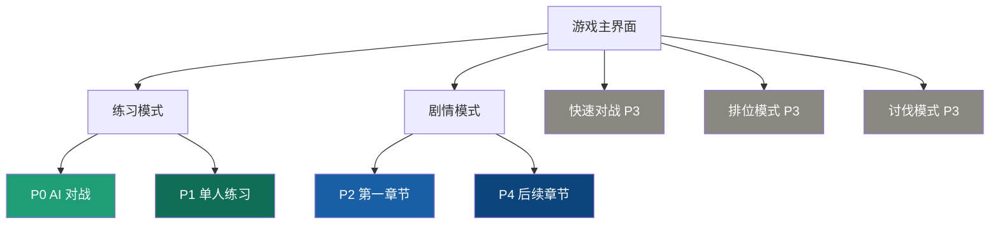
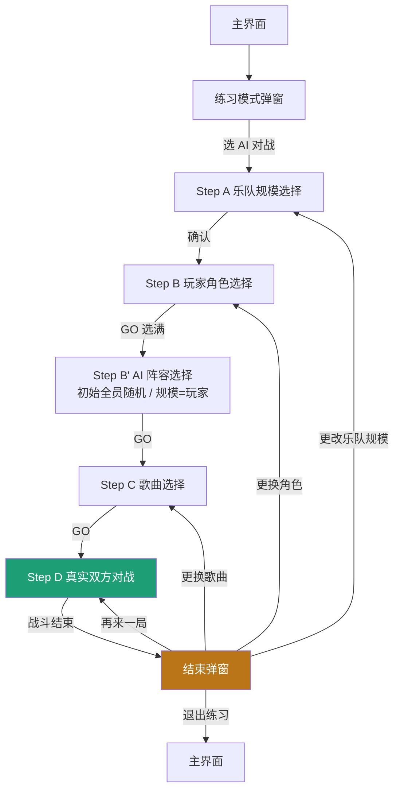
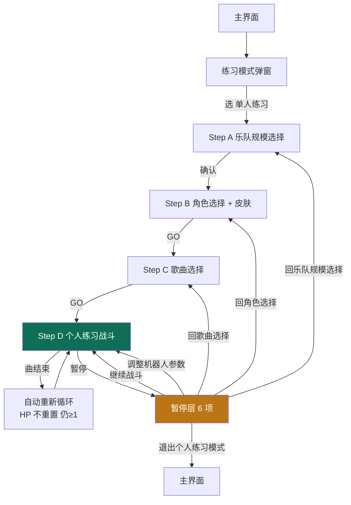
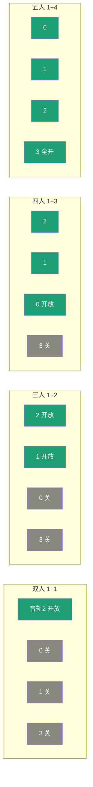
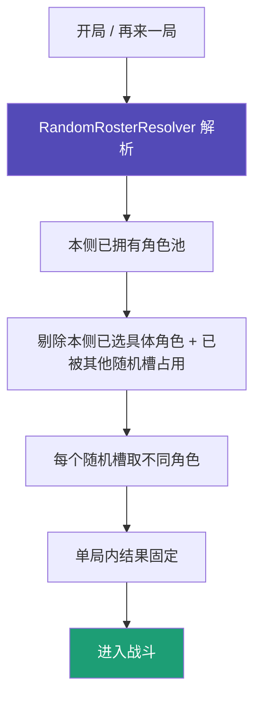
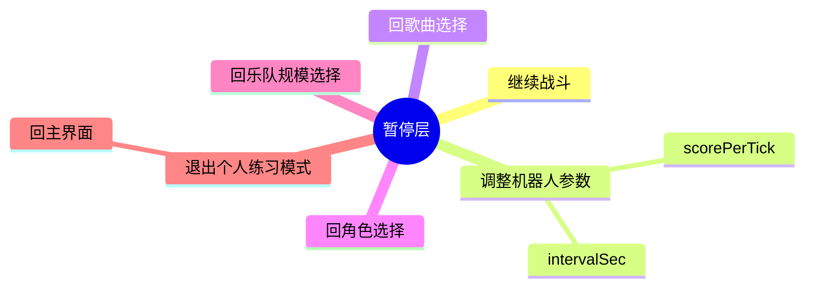
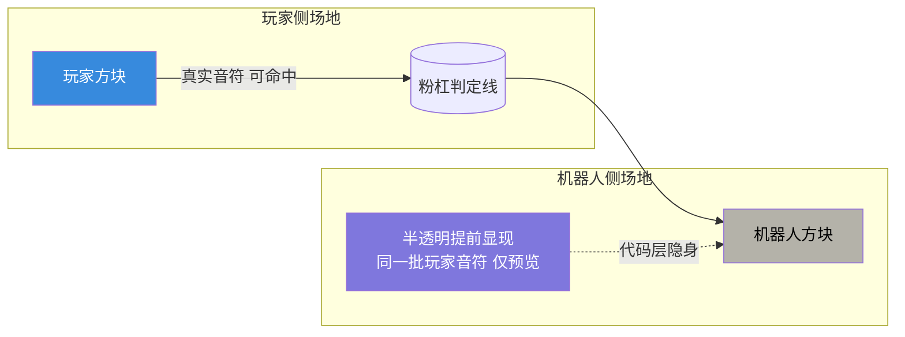

# 练习模式 · 流程思维导图

> 用 Mermaid 绘制。在支持 Mermaid 的查看器（GitHub / 飞书文档 / VS Code 插件 / Typora）中可直接渲染。
> 本文件聚焦「整体流程循环」的直观认知，细节见 01_需求文档 与 04_功能对接文档。

---

## 1. 模式优先级阶梯

> 优先级：**P0 AI 对战 → P1 单人练习 → P2 剧情第一章 → P3 快速/排位/讨伐（置灰）→ P4 剧情后续**。
> 主菜单按钮顺序：练习 → 剧情 → 快速 → 排位 → 讨伐。

---

## 2. AI 对战整体流程（P0）

---

## 3. 单人练习整体流程（P1）

---

## 4. 乐队规模 → 音轨开放映射

> 开放顺序固定为 **2 → 1 → 0 → 3**；关闭位置完全不显示。主角固定在中央主位（非音轨位）。

---

## 5. 随机人物卡解析与去重

> 去重范围仅限**本侧**；每次开局重新随机；同局内不漂移。

---

## 6. 单人练习暂停层 6 项

---

## 7. 单人练习场地（半透明音符）

> 半透明音符 = 玩家自己的音符提前显现（非镜像）；代码层仍隐身，不影响附魔等判定逻辑。
